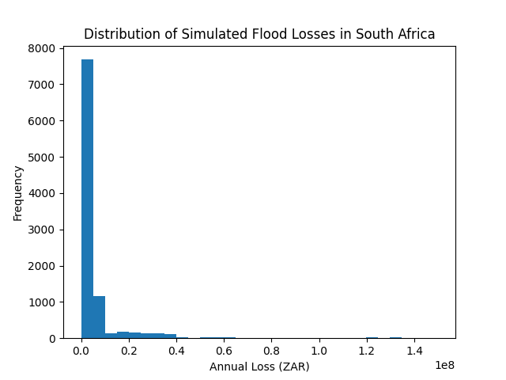

# Flood Risk Monte Carlo Simulation (South Africa)

## Overview
This project models flood-related financial losses using a Monte Carlo simulation approach.

The model simulates 10,000 years of possible flood outcomes based on:

- Probability of flood occurrence
- Severity levels of floods
- Randomised financial losses

## Risk Metrics Calculated

Expected Annual Loss (EAL): ~R5.94 million  
95% Value at Risk (VaR): ~R31.78 million  
Tail Value at Risk (TVaR): ~R69.37 million  

## Key Insight

Flood risk demonstrates a **low-frequency, high-severity pattern**, where most years experience no losses, but rare catastrophic events produce very large financial impacts.

## Tools Used

- Python
- NumPy
- Pandas
- Matplotlib

- Jupyter Notebook

- ## Example Output

Below is the simulated distribution of annual flood losses:

